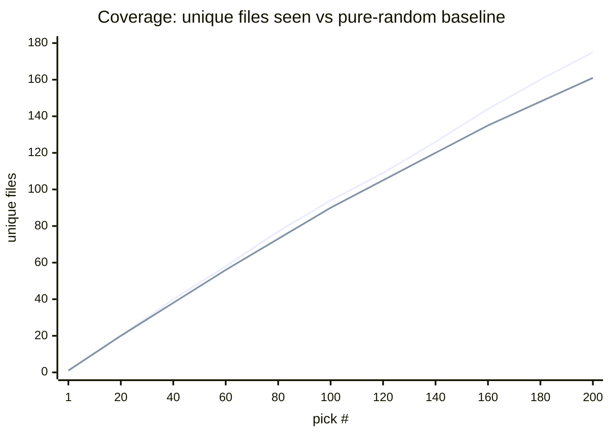
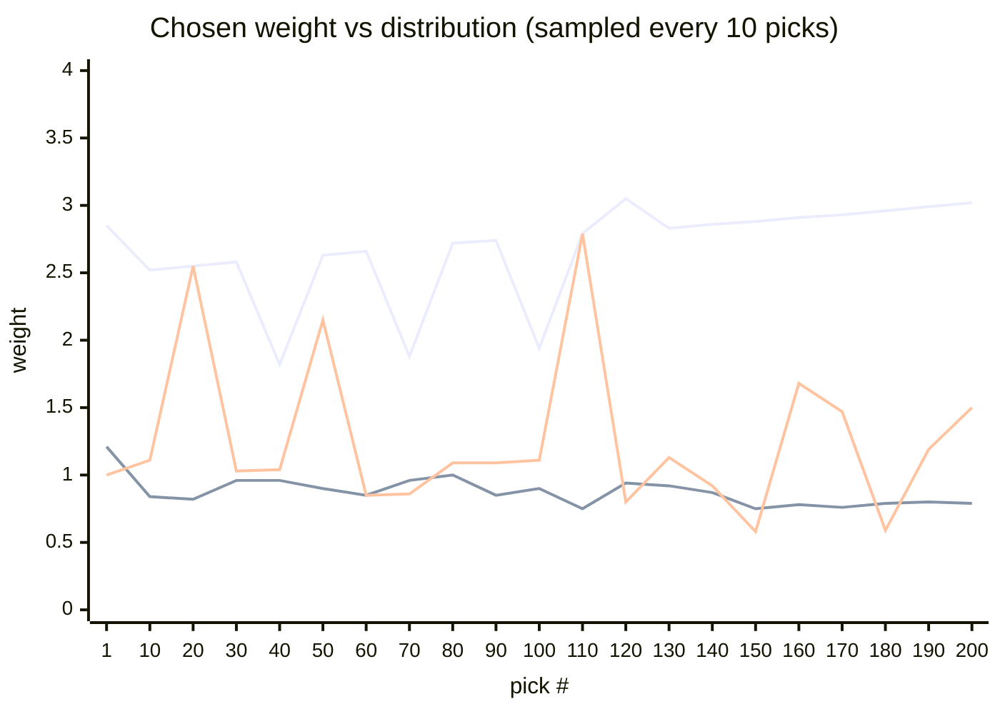
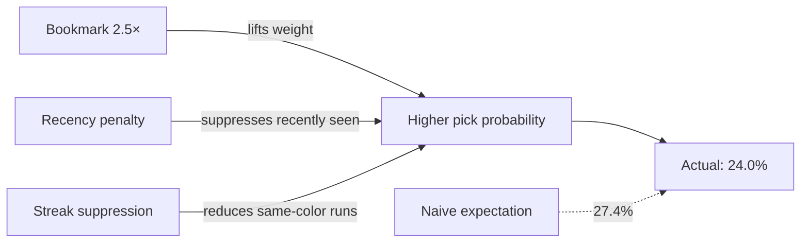
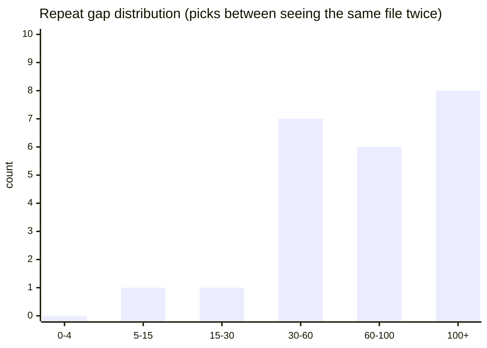

# Perceived Randomness vs Computer Randomness
### A data-driven note on why fair randomness feels broken. And what to do about it

> **Session:** 450 included files · 200 picks · Randomness slider 50% · Red & green bookmarks at 2.5×

---

## Table of Contents

1. [The core tension](#1-the-core-tension)
2. [What true random actually does](#2-what-true-random-actually-does)
3. [The birthday problem, quantified](#3-the-birthday-problem-quantified)
4. [What the 200-pick session shows](#4-what-the-200-pick-session-shows)
5. [Chosen weight vs the distribution](#5-chosen-weight-vs-the-distribution)
6. [Bookmarks and weighted fairness](#6-bookmarks-and-weighted-fairness)
7. [Repeat gaps: the fingerprint of anti-repeat logic](#7-repeat-gaps-the-fingerprint-of-anti-repeat-logic)
8. [The algorithm's balancing act](#8-the-algorithms-balancing-act)
9. [Conclusions](#9-conclusions)

---

## 1. The core tension

Humans have a deeply held intuition about randomness: *it should feel even*. If you shuffle a deck of cards 200 times, you expect every card to appear roughly the same number of times. If one card shows up five times in a row you call the deck rigged.

The problem is that this intuition is **wrong**. Uniform coverage is not a property of randomness. It is the opposite of it. True randomness clusters, repeats, and leaves long gaps. The clustering *is* the randomness. When a music player shuffles the same artist three songs in a row, the shuffle is working correctly. When it feels broken is when your expectations are calibrated to a different distribution than the one being sampled.

This creates a design problem: build a randomiser that is mathematically correct, or one that *feels* correct? This paper uses a real 200-pick diagnostic session to examine the current logic of the project.

---

## 2. What true random actually does

Imagine a uniform random sampler drawing from a pool of $N$ items with replacement. After $k$ draws:

$$\mathbb{E}[\text{unique items}] = N \cdot \left(1 - \left(1 - \frac{1}{N}\right)^k\right) \approx N \cdot \left(1 - e^{-k/N}\right)$$

This is the **coupon collector's problem**. Its punchline: collecting *all* items takes disproportionately long. The last 10% of the library takes as many picks as the first 63%.

The flip side is the **birthday paradox**: repetitions arrive far sooner than expected. With $N = 450$ and $k = 200$, the expected number of repeated-file events under pure uniform random is:

$$\text{expected repeats} \approx k - N\left(1 - e^{-k/N}\right) \approx 200 - 161.4 = 38.6$$

So about 39 of the 200 picks under pure random would be duplicates you had already seen. Most people find that jarring even at 200 picks. And it gets worse as the library grows.

---

## 3. The birthday problem, quantified

| Scenario | Expected unique files after 200 picks |
|---|---|
| Pure uniform random | **≈ 161** |
| This session (actual) | **173** |
| Theoretical maximum (all different) | 200 |

The gap between 161 and 173 is not luck — it is the anti-repeat recency penalty actively suppressing re-picks. **The algorithm surfaced 12 more unique files than pure random would have.**



*Top line: actual unique files seen. Bottom line: pure-random birthday-problem baseline.*

The actual coverage line tracked *above* the pure-random baseline for the entire session. This is the core promise of the recency penalty: deliver more of your library, sooner.

---

## 4. What the 200-pick session shows

<details>
<summary><strong>Full session statistics</strong></summary>

| Metric | Value | Notes |
|---|---|---|
| Total files | 513 | 63 excluded by filter rules |
| Included in pool | 450 | |
| Total picks | 200 | |
| Unique files seen | 173 | 38.4% of pool |
| Coverage | **39.3%** | above pure-random baseline of ~35.9% |
| Never picked | 273 | expected given pick count |
| Weight spread | 0.00 – 3.00 | 0 = hard-blocked by recency |
| Avg weight | 0.84 | pulled down by recency-zeroed files |
| Fairness (Gini) | **0.279** | 0 = equal, 1 = one file gets everything |
| Pick entropy | **0.992** | 0 = one file, 1 = perfectly uniform |
| Anti-repeat hits | 4.0% | recency penalty reduced a file's weight |
| Avg memory factor | 0.981 | near 1.0 = penalty rarely kicks hard |
| Chosen / max weight | **0.443** | picks land near the mean, not the peak |
| Avg effective pool | 450.0 | no files were structurally excluded |
| Bookmark pick rate | **24.0%** | 59 bookmarked files = 13.1% of pool |

</details>

### What each number means

**Gini 0.279**: Weight distribution is slightly skewed (bookmarks pull some files higher) but far from winner-take-all. A Gini of 0 would mean every file has the same weight; a Gini of 1 would mean one file has all the weight.

**Entropy 0.992**: The actual pick distribution is 99.2% as uniform as a theoretically perfect shuffle. Despite red/green bookmarks carrying 2.5× weight and the recency system blocking some files, the observed pick pattern is nearly indistinguishable from uniform. This is the right result.

**Anti-repeat hits 4.0%**: In only 8 of 200 picks did the recency penalty meaningfully reduce a candidate's weight. The system intervened rarely and surgically.

**Avg memory factor 0.981**: When it did intervene, the average penalty was mild (factor of ~0.98 vs 1.0 = no penalty). The recency system is not heavy-handed.

---

## 5. Chosen weight vs the distribution

Every pick, the algorithm records three numbers: the weight of the chosen file, the mean weight across all candidates, and the maximum weight in the pool. These appear in the *Chosen weight vs distribution* chart.



*Top line: max weight in pool. Middle line: mean weight. Bottom (spiky) line: chosen file's weight — spikes are bookmarked picks.*

The **chosen / max weight ratio of 0.443** is the key insight. If the picker always chose the highest-weight file, this ratio would be close to 1.0. Instead it sits near 0.44. Meaning on average, the file chosen had less than half the weight of the most-probable candidate at that moment.

This is the algorithm's egalitarian character. The bookmarks do lift some files' weights, the recency system does suppress recently-seen ones. But neither factor dominates. The chosen file is almost always a mid-weight file, which is exactly the behaviour you want when the goal is fair coverage rather than exploitation of a score function.

---

## 6. Bookmarks and weighted fairness

59 of 450 files (13.1%) were bookmarked with 2.5× multiplier.

**Naive expectation:** if bookmarks simply applied 2.5×, their pick share would be:

$$\frac{59 \times 2.5}{59 \times 2.5 + 391 \times 1.0} = \frac{147.5}{538.5} \approx 27.4\%$$

**Actual bookmark pick rate: 24.0%**

The 3.4 percentage point gap comes from two competing forces:



The recency penalty treats bookmarked files no differently from others. Once seen, they enter the cool-down window. The streak suppressor also penalises runs of the same bookmark colour. Both forces pull the bookmark rate slightly below the naive expectation. **This is the intended behaviour:** the multiplier biases towards bookmarks without letting them monopolise the session.

---

## 7. Repeat gaps: the fingerprint of anti-repeat logic

The repeat gap distribution answers: *when a file appears for the second time, how many other picks separated the two appearances?*

| Gap bucket | Count | What it means |
|---|---|---|
| 0–4 picks | **0** | Hard block working, no quick re-picks |
| 5–15 | 1 | Near-immediate repeats extremely rare |
| 15–30 | 1 | Short-cycle repeats suppressed |
| 30–60 | 7 | Medium-gap repeats start appearing |
| 60–100 | 6 | Gaps around recency window boundary |
| 100+ | 8 | Files seen again after full cool-down |



> **The empty `0–4` bucket is not a coincidence.** The hard anti-repeat block zeroes the weight of recently-seen files for a window proportional to $\sqrt{N}$. With $N = 450$, the recency window is $\lfloor\sqrt{450} \times 4\rfloor = 84$ picks. Within that window, re-picks are suppressed, and within the first 5 picks, they are impossible.

The peak at `100+` is also expected: most files that get repeated are doing so after the recency window fully expires and they re-enter the pool at full weight.

---

## 8. The algorithm's balancing act

The tension between *mathematically fair* and *perceptually fair* is resolved through a layered approach:

```
┌─────────────────────────────────────────────────────┐
│                   Weight formula                    │
│                                                     │
│  w = base                                           │
│      × memory_factor     ← recency penalty          │
│      × bookmark_factor   ← 2.5× for bookmarked      │
│      × path_weight       ← user-set folder bias     │
│      × coverage_factor   ← underpicked files get ↑  │
│      × color_streak      ← same colour penalised    │
│      × folder_streak     ← same folder penalised    │
│                                                     │
│  Hard block: last N picks zeroed out entirely       │
└─────────────────────────────────────────────────────┘
```

Each factor nudges the distribution toward *perceived fairness* without destroying the underlying randomness:

- **Memory factor** prevents visible repeats: the most psychologically jarring form of "bad random"
- **Coverage factor** gives underpicked files a slight advantage: reduces the long tail of never-seen files
- **Streak suppression** prevents runs of the same colour or folder: perceived clustering
- **Bookmark factor** is a user-configured thumb on the scale, fully transparent

None of these factors are deterministic. They modify weights, not outcomes. The sampler is still drawing from a `WeightedIndex`. So rare events still happen, just less often.

### Why entropy is still 0.992 despite all this

Adding recency penalties and streak suppression to a uniform sampler should theoretically reduce entropy. The reason it stays near 1.0 is that the penalties are **relative, not absolute**. A file with weight 0.5 (due to recency) can still be picked, it is just half as likely as an unboosted file. The distribution remains broad. Only the hard block (weight → 0) reduces the effective pool, and that is temporary.

---

## 9. Conclusions

| Question | Answer from the data |
|---|---|
| Does the anti-repeat system improve coverage? | **Yes.** 173 unique files vs ≈ 161 expected under pure random |
| Does weighting break entropy? | **No.** Entropy = 0.992, near-perfect uniformity |
| Do bookmarks dominate? | **No.** 24% pick rate vs 27.4% naive expectation — recency tempers them |
| Does the picker cherry-pick high-weight files? | **No.** Chosen/max ratio = 0.443 — average-weight files win most often |
| Are quick repeats suppressed? | **Yes.** Empty `0–4` repeat-gap bucket |

The core finding is that the algorithm sits in the right part of the design space: it delivers better-than-random coverage (birthday problem solved), feels less clustered than true random (streak and recency suppression), and preserves near-perfect entropy (no single file or folder dominates). The 3.4 percentage point gap between naive bookmark expectation and actual bookmark rate is the cost of that balance worth paying.

Human intuition expects randomness to feel like a well-shuffled deck dealt without replacement. Real randomness is dealt *with* replacement. The gap between those two mental models is where most "this shuffle is broken" complaints live. The data shows that a relatively lightweight set of weight modifiers is sufficient to close most of that gap without making the result feel mechanical or predictable.

---

*Written from a 200-pick diagnostic session on 2026-05-21 with Claude on it. All file names anonymised.*
